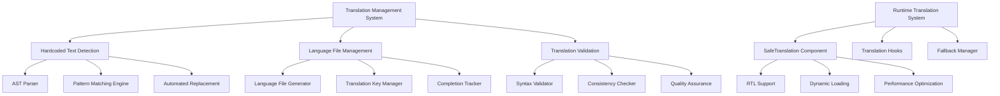

# Design Document

## Overview

The i18n multilingual enhancement design focuses on creating a comprehensive internationalization system that eliminates hardcoded text strings, expands language support, and provides robust translation management tools. The system will build upon the existing i18next infrastructure while introducing automated detection, replacement workflows, and enhanced language capabilities including RTL support.

## Architecture

### Current State Analysis

The application currently has:
- **3 supported languages**: en-US, pt-BR, es-ES

- **Existing i18n infrastructure**: i18next with react-i18next integration
- **SafeTranslation component**: Provides fallback handling and development warnings
- **Translation utilities**: Helper functions for safe translation operations
- **Translation audit scripts**: Basic hardcoded text detection capabilities

### Target Architecture



## Components and Interfaces

### 1. Enhanced Translation Detection System

#### HardcodedTextDetector
```typescript
interface HardcodedTextDetector {
  scanDirectory(path: string): Promise<HardcodedString[]>;
  analyzeFile(filePath: string): Promise<FileAnalysisResult>;
  generateReplacementSuggestions(strings: HardcodedString[]): ReplacementSuggestion[];
  validateReplacements(suggestions: ReplacementSuggestion[]): ValidationResult[];
}

interface HardcodedString {
  text: string;
  filePath: string;
  lineNumber: number;
  columnNumber: number;
  context: string;
  suggestedKey: string;
  confidence: number;
  category: 'ui' | 'error' | 'validation' | 'notification' | 'content';
}

interface ReplacementSuggestion {
  originalText: string;
  translationKey: string;
  filePath: string;
  lineNumber: number;
  replacementCode: string;
  namespace: string;
}
```

#### AST-Based Text Extraction
```typescript
interface ASTTextExtractor {
  extractFromJSX(ast: any): JSXTextNode[];
  extractFromStringLiterals(ast: any): StringLiteralNode[];
  extractFromTemplateStrings(ast: any): TemplateStringNode[];
  extractFromObjectProperties(ast: any): ObjectPropertyNode[];
}
```

### 2. Language Management System

#### LanguageManager
```typescript
interface LanguageManager {
  addLanguage(languageCode: string, languageName: string): Promise<void>;
  removeLanguage(languageCode: string): Promise<void>;
  getLanguageCompletionStatus(languageCode: string): Promise<CompletionStatus>;
  syncTranslationKeys(): Promise<SyncResult>;
  validateLanguageFiles(): Promise<ValidationReport>;
}

interface CompletionStatus {
  languageCode: string;
  totalKeys: number;
  translatedKeys: number;
  missingKeys: string[];
  completionPercentage: number;
  lastUpdated: Date;
}
```

#### Translation File Structure
```typescript
interface TranslationFile {
  common: CommonTranslations;
  auth: AuthTranslations;
  tickets: TicketTranslations;
  dashboard: DashboardTranslations;
  admin: AdminTranslations;
  notifications: NotificationTranslations;
  chat: ChatTranslations;
  knowledge: KnowledgeTranslations;
  reports: ReportTranslations;
  errors: ErrorTranslations;
}

interface CommonTranslations {
  actions: ActionTranslations;
  navigation: NavigationTranslations;
  forms: FormTranslations;
  status: StatusTranslations;
  time: TimeTranslations;
  numbers: NumberTranslations;
}
```

### 3. Enhanced SafeTranslation System

#### RTL-Aware SafeTranslation
```typescript
interface RTLSafeTranslationProps extends SafeTranslationProps {
  rtlSupport?: boolean;
  textDirection?: 'ltr' | 'rtl' | 'auto';
  rtlClassName?: string;
}

interface LanguageDirection {
  isRTL: boolean;
  direction: 'ltr' | 'rtl';
  textAlign: 'left' | 'right';
  className: string;
}
```

#### Advanced Translation Hooks
```typescript
interface TranslationHooks {
  useRTLTranslation: (key: string, options?: TranslationOptions) => RTLTranslationResult;
  usePluralTranslation: (key: string, count: number, options?: PluralOptions) => string;
  useFormattedTranslation: (key: string, values: FormatValues, options?: FormatOptions) => string;
  useConditionalTranslation: (conditions: TranslationCondition[]) => string;
}

interface RTLTranslationResult {
  text: string;
  isRTL: boolean;
  direction: 'ltr' | 'rtl';
  className: string;
}
```

### 4. Translation Management Tools

#### TranslationManager CLI
```typescript
interface TranslationCLI {
  scan(): Promise<ScanResult>;
  replace(options: ReplaceOptions): Promise<ReplaceResult>;
  addLanguage(languageCode: string): Promise<AddLanguageResult>;
  validate(): Promise<ValidationResult>;
  sync(): Promise<SyncResult>;
  export(format: 'json' | 'csv' | 'xlsx'): Promise<ExportResult>;
}

interface ScanResult {
  hardcodedStrings: HardcodedString[];
  totalFiles: number;
  affectedFiles: string[];
  estimatedReplacementTime: number;
  suggestions: ReplacementSuggestion[];
}
```

## Data Models

### Translation Key Hierarchy
```
common.
├── actions.
│   ├── save
│   ├── cancel
│   ├── delete
│   ├── edit
│   └── create
├── navigation.
│   ├── home
│   ├── tickets
│   ├── dashboard
│   └── admin
├── forms.
│   ├── validation.
│   │   ├── required
│   │   ├── email
│   │   └── minLength
│   └── placeholders.
│       ├── search
│       ├── email
│       └── password
└── status.
    ├── loading
    ├── success
    ├── error
    └── warning
```

### Language Configuration
```typescript
interface LanguageConfig {
  code: string; // e.g., 'ar-SA'
  name: string; // e.g., 'العربية'
  nativeName: string; // e.g., 'العربية'
  direction: 'ltr' | 'rtl';
  dateFormat: string;
  numberFormat: Intl.NumberFormatOptions;
  currencyFormat: Intl.NumberFormatOptions;
  enabled: boolean;
  completionPercentage: number;
  lastUpdated: Date;
}
```

### Translation Metadata
```typescript
interface TranslationMetadata {
  key: string;
  namespace: string;
  context: string;
  description: string;
  maxLength?: number;
  pluralizable: boolean;
  interpolationVariables: string[];
  lastModified: Date;
  translator: string;
  reviewStatus: 'pending' | 'approved' | 'rejected';
}
```

## Error Handling

### Translation Error Types
```typescript
enum TranslationErrorType {
  MISSING_KEY = 'MISSING_KEY',
  INTERPOLATION_ERROR = 'INTERPOLATION_ERROR',
  LOADING_ERROR = 'LOADING_ERROR',
  SYNTAX_ERROR = 'SYNTAX_ERROR',
  NETWORK_ERROR = 'NETWORK_ERROR'
}

interface TranslationError {
  type: TranslationErrorType;
  key: string;
  message: string;
  context?: string;
  fallbackUsed: string;
  timestamp: Date;
}
```

### Fallback Strategy
1. **Primary**: Use requested translation key
2. **Secondary**: Use fallback language (en-US)
3. **Tertiary**: Use provided fallback text
4. **Final**: Use translation key as display text

### Error Recovery
```typescript
interface ErrorRecoveryStrategy {
  logError(error: TranslationError): void;
  reportMissingKey(key: string, context: string): void;
  cacheFallback(key: string, fallback: string): void;
  retryTranslation(key: string, maxRetries: number): Promise<string>;
}
```

## Testing Strategy

### Unit Testing
- **SafeTranslation Component**: Test fallback behavior, RTL support, error handling
- **Translation Utilities**: Test helper functions, formatting, validation
- **Language Manager**: Test language addition, removal, validation
- **Hardcoded Text Detector**: Test pattern matching, AST parsing, suggestion generation

### Integration Testing
- **Language Switching**: Test dynamic language changes across components
- **RTL Layout**: Test layout mirroring and text direction changes
- **Translation Loading**: Test lazy loading and caching behavior
- **Error Scenarios**: Test missing translations, network failures, corrupted files

### End-to-End Testing
- **Complete User Flows**: Test ticket creation, user management, dashboard navigation in multiple languages
- **Language Persistence**: Test language preference saving and restoration
- **Performance**: Test translation loading times and memory usage
- **Accessibility**: Test screen reader compatibility with RTL languages

### Automated Testing
```typescript
interface TranslationTestSuite {
  validateAllTranslationFiles(): Promise<ValidationResult[]>;
  testKeyConsistency(): Promise<ConsistencyReport>;
  testInterpolationVariables(): Promise<InterpolationReport>;
  testPluralizations(): Promise<PluralizationReport>;
  performanceTest(): Promise<PerformanceReport>;
}
```

## Performance Optimization

### Lazy Loading Strategy
- Load only the current language on initial page load
- Implement on-demand loading for language switching
- Cache loaded languages in memory with LRU eviction
- Preload commonly used languages based on user patterns

### Bundle Optimization
```typescript
interface BundleOptimization {
  splitTranslationsByNamespace(): void;
  implementTreeShaking(): void;
  compressTranslationFiles(): void;
  generateStaticImports(): void;
}
```

### Caching Strategy
- **Browser Cache**: Store translation files with versioning
- **Memory Cache**: Keep active language in memory
- **Service Worker**: Cache translations for offline use
- **CDN**: Serve translation files from CDN for global users

### Memory Management
```typescript
interface MemoryManager {
  trackTranslationMemoryUsage(): MemoryUsage;
  cleanupUnusedTranslations(): void;
  optimizeTranslationStorage(): void;
  monitorMemoryLeaks(): void;
}
```

## RTL Support Implementation

### CSS-in-JS RTL Handling
```typescript
interface RTLStyleManager {
  generateRTLStyles(baseStyles: CSSProperties): CSSProperties;
  mirrorLayout(component: ReactElement): ReactElement;
  handleDirectionalIcons(iconName: string, direction: 'ltr' | 'rtl'): string;
  applyRTLClassNames(className: string, isRTL: boolean): string;
}
```

### Layout Mirroring
- Automatic CSS property mirroring (margin-left ↔ margin-right)
- Icon direction adjustment (chevron-left ↔ chevron-right)
- Text alignment changes (text-left ↔ text-right)
- Flexbox direction handling (flex-row ↔ flex-row-reverse)

### Component RTL Adaptation
```typescript
interface RTLComponent {
  detectLanguageDirection(): 'ltr' | 'rtl';
  applyRTLStyles(): void;
  mirrorInteractiveElements(): void;
  adjustScrollBehavior(): void;
}
```

## Migration Strategy

### Phase 1: Infrastructure Setup
1. Enhance existing translation detection scripts
2. Create new language files for additional languages
3. Implement RTL support infrastructure
4. Set up automated translation validation

### Phase 2: Hardcoded Text Replacement
1. Run comprehensive scan for hardcoded strings
2. Generate translation keys and add to language files
3. Replace hardcoded strings with SafeTranslation components
4. Validate replacements and test functionality

### Phase 3: Language Expansion
1. Add new language files (it-IT, ja-JP, zh-CN, ar-SA)
2. Implement RTL support for Arabic
3. Add language switching UI enhancements
4. Test all languages for completeness

### Phase 4: Quality Assurance
1. Comprehensive testing across all languages
2. Performance optimization and caching
3. Accessibility testing with screen readers
4. User acceptance testing with native speakers

This design provides a comprehensive foundation for implementing robust internationalization while maintaining performance and user experience quality.