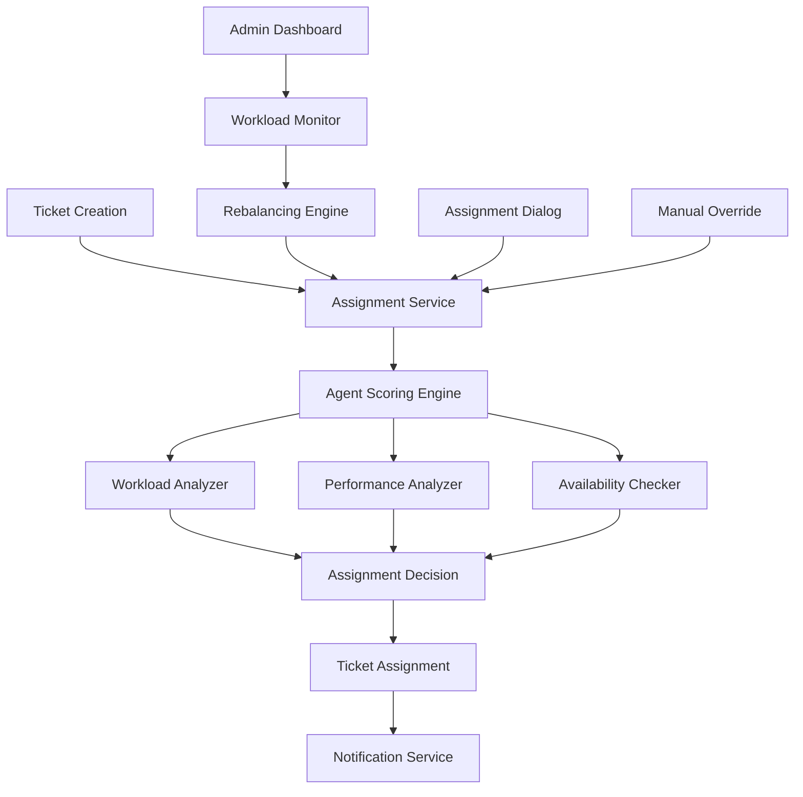

# Design Document

## Overview

The Intelligent Assignment System is a comprehensive solution that enhances the Analy-Ticket platform with AI-powered ticket distribution capabilities. The system uses a multi-factor scoring algorithm to automatically assign tickets to the most suitable agents while providing administrators with real-time monitoring and workload management tools.

## Architecture

### High-Level Architecture



### System Components

1. **Assignment Service Core** (`assignmentService.ts`)
   - Central orchestrator for all assignment operations
   - Implements scoring algorithms and business rules
   - Manages agent metrics and availability

2. **Workload Dashboard** (`WorkloadDashboard.tsx`)
   - Real-time monitoring interface for administrators
   - Displays team metrics and individual agent status
   - Provides rebalancing controls

3. **Enhanced Assignment Dialogs**
   - Intelligent assignment recommendations
   - Manual assignment with enhanced agent information
   - Dual-mode interface for flexibility

4. **Agent Metrics System**
   - Real-time workload tracking
   - Performance metrics calculation
   - Availability status monitoring

## Components and Interfaces

### Core Service Interface

```typescript
interface AssignmentService {
  getAvailableAgents(): Promise<AgentMetrics[]>
  findBestAgent(ticketData: TicketData): Promise<AssignmentResult>
  assignTicket(ticketId: string, agentId?: string): Promise<AssignmentResult>
  rebalanceWorkload(): Promise<RebalanceResult>
}
```

### Agent Metrics Interface

```typescript
interface AgentMetrics {
  id: string
  full_name: string
  email: string
  role: UserRole
  currentWorkload: number
  maxConcurrentTickets: number
  averageResolutionTime: number
  resolutionRate: number
  customerSatisfactionScore: number
  availability: 'available' | 'busy' | 'away' | 'offline'
  lastActivity: Date
  specializations: string[]
}
```

### Assignment Result Interface

```typescript
interface AssignmentResult {
  success: boolean
  assignedAgent?: AgentMetrics
  reason: string
  confidence: number
  alternativeAgents?: AgentMetrics[]
}
```

## Data Models

### Agent Scoring Model

The system uses a weighted scoring algorithm:

```typescript
const WORKLOAD_WEIGHT = 0.4    // 40% - Current capacity utilization
const PERFORMANCE_WEIGHT = 0.3  // 30% - Historical performance metrics
const AVAILABILITY_WEIGHT = 0.3 // 30% - Current availability status

totalScore = (workloadScore * WORKLOAD_WEIGHT) + 
             (performanceScore * PERFORMANCE_WEIGHT) + 
             (availabilityScore * AVAILABILITY_WEIGHT)
```

### Workload Calculation

```typescript
// Basic workload score (inverse of utilization)
workloadScore = max(0, 1 - (currentTickets / maxTickets))

// Weighted workload considering priority
weightedWorkload = sum(ticketPriority * priorityWeight)
priorityWeights = { urgent: 3, high: 2, medium: 1.5, low: 1 }
```

### Performance Metrics

```typescript
// Performance score components
resolutionScore = resolutionRate // 0-1 scale
satisfactionScore = customerSatisfactionScore / 5 // 0-1 scale
timeScore = max(0, 1 - (averageResolutionTime / 48)) // 48h baseline

performanceScore = (resolutionScore + satisfactionScore + timeScore) / 3
```

## Error Handling

### Assignment Failures

1. **No Available Agents**
   - Return failure result with clear reason
   - Suggest manual assignment or wait time
   - Log for administrative review

2. **Agent at Capacity**
   - Exclude from automatic assignment
   - Provide alternative agent suggestions
   - Enable manual override if necessary

3. **Database Errors**
   - Graceful degradation to manual assignment
   - Error logging and notification
   - Retry mechanisms for transient failures

### Fallback Mechanisms

```typescript
// Assignment fallback chain
try {
  result = await intelligentAssignment(ticket)
} catch (error) {
  try {
    result = await roundRobinAssignment(ticket)
  } catch (error) {
    result = await manualAssignmentRequired(ticket)
  }
}
```

## Testing Strategy

### Unit Testing

1. **Assignment Algorithm Tests**
   - Scoring calculation accuracy
   - Edge case handling (no agents, all busy)
   - Workload balancing logic

2. **Agent Metrics Tests**
   - Workload calculation correctness
   - Performance metric aggregation
   - Availability status determination

3. **Integration Tests**
   - Database interaction testing
   - Notification system integration
   - Real-time updates verification

### Component Testing

1. **Dashboard Component Tests**
   - Real-time data display
   - Rebalancing functionality
   - User interaction handling

2. **Assignment Dialog Tests**
   - AI recommendation display
   - Manual assignment flow
   - Error state handling

### Performance Testing

1. **Load Testing**
   - High-volume ticket assignment
   - Concurrent agent metric updates
   - Dashboard real-time performance

2. **Scalability Testing**
   - Large agent pool handling
   - Multiple simultaneous assignments
   - Database query optimization

## Security Considerations

### Access Control

1. **Role-Based Permissions**
   - Admin-only access to workload dashboard
   - Agent-specific assignment capabilities
   - User role validation for all operations

2. **Data Protection**
   - Secure agent metric storage
   - Encrypted performance data
   - Audit logging for assignments

### Input Validation

```typescript
// Assignment request validation
const validateAssignmentRequest = (ticketId: string, agentId?: string) => {
  if (!isValidUUID(ticketId)) throw new ValidationError('Invalid ticket ID')
  if (agentId && !isValidUUID(agentId)) throw new ValidationError('Invalid agent ID')
  if (agentId && !isAuthorizedAgent(agentId)) throw new AuthorizationError('Unauthorized agent')
}
```

## Performance Optimizations

### Caching Strategy

1. **Agent Metrics Caching**
   - 5-minute cache for performance metrics
   - Real-time cache invalidation on ticket updates
   - Memory-based caching for frequently accessed data

2. **Assignment Result Caching**
   - Cache assignment recommendations for similar tickets
   - Invalidate on agent status changes
   - Reduce database queries for repeated requests

### Database Optimization

1. **Query Optimization**
   - Indexed queries for agent lookups
   - Batch operations for workload calculations
   - Optimized joins for ticket-agent relationships

2. **Real-time Updates**
   - Supabase real-time subscriptions for live data
   - Efficient change detection and propagation
   - Minimal payload updates for dashboard

## Monitoring and Analytics

### Key Metrics

1. **Assignment Effectiveness**
   - Assignment success rate
   - Average assignment time
   - Agent satisfaction with assignments

2. **Workload Distribution**
   - Utilization variance across agents
   - Rebalancing frequency and effectiveness
   - Peak load handling performance

3. **Performance Impact**
   - Response time improvements
   - Resolution time changes
   - Customer satisfaction correlation

### Logging Strategy

```typescript
// Assignment event logging
const logAssignmentEvent = {
  timestamp: new Date(),
  ticketId: string,
  assignedAgent: string,
  assignmentMethod: 'intelligent' | 'manual' | 'rebalanced',
  confidence: number,
  reason: string,
  alternativeAgents: string[]
}
```

## Deployment Considerations

### Feature Flags

1. **Gradual Rollout**
   - Enable intelligent assignment for specific ticket types
   - A/B testing between manual and intelligent assignment
   - Rollback capability for issues

2. **Configuration Management**
   - Adjustable scoring weights
   - Configurable capacity limits
   - Business hours customization

### Migration Strategy

1. **Backward Compatibility**
   - Existing manual assignment remains functional
   - Gradual migration of assignment workflows
   - No breaking changes to current interfaces

2. **Data Migration**
   - Historical performance data import
   - Agent capacity configuration
   - Assignment rule setup

This design provides a robust, scalable, and maintainable intelligent assignment system that enhances the Analy-Ticket platform while preserving existing functionality and user workflows.