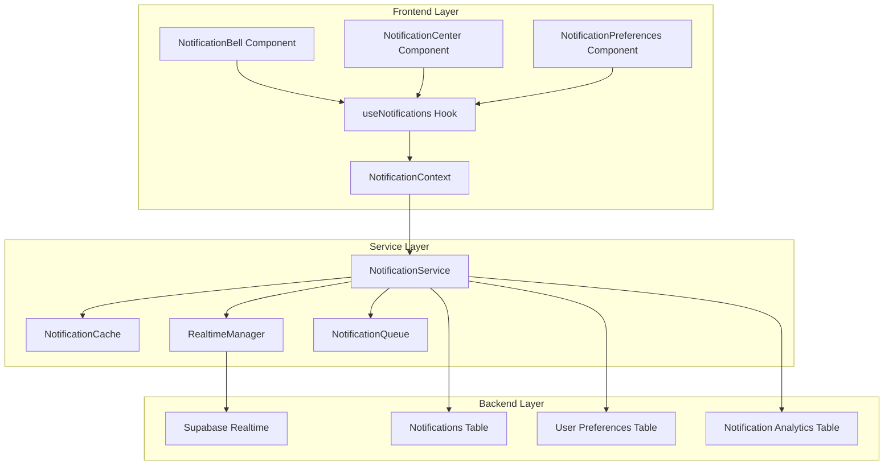

# Design Document

## Overview

This design document outlines the architecture and implementation approach for enhancing the Analy-Ticket notification system. The improvements focus on real-time delivery, user customization, performance optimization, and enhanced user experience while maintaining backward compatibility with the existing system.

## Architecture

### High-Level Architecture



### Component Architecture

The notification system will be restructured with the following key components:

1. **NotificationManager**: Central orchestrator for all notification operations
2. **RealtimeSubscriptionManager**: Handles WebSocket connections and reconnection logic
3. **NotificationCache**: Implements intelligent caching with TTL and invalidation
4. **NotificationQueue**: Manages offline queuing and retry mechanisms
5. **PreferencesManager**: Handles user preference storage and validation

## Components and Interfaces

### Core Service Interfaces

```typescript
interface INotificationManager {
  // Core operations
  getNotifications(userId: string, options?: NotificationQueryOptions): Promise<NotificationWithTicket[]>
  createNotification(notification: CreateNotificationRequest): Promise<boolean>
  markAsRead(notificationId: string): Promise<boolean>
  markAllAsRead(userId: string): Promise<boolean>
  deleteNotification(notificationId: string): Promise<boolean>
  
  // Real-time operations
  subscribe(userId: string, callback: NotificationCallback): Subscription
  unsubscribe(subscription: Subscription): void
  
  // Preference operations
  getUserPreferences(userId: string): Promise<NotificationPreferences>
  updateUserPreferences(userId: string, preferences: Partial<NotificationPreferences>): Promise<boolean>
}

interface INotificationCache {
  get(key: string): Promise<any>
  set(key: string, value: any, ttl?: number): Promise<void>
  invalidate(pattern: string): Promise<void>
  clear(): Promise<void>
}

interface IRealtimeManager {
  connect(userId: string): Promise<RealtimeConnection>
  disconnect(userId: string): Promise<void>
  isConnected(userId: string): boolean
  getConnectionStatus(userId: string): ConnectionStatus
}
```

### Data Models

```typescript
interface NotificationPreferences {
  userId: string
  emailNotifications: boolean
  toastNotifications: boolean
  soundNotifications: boolean
  quietHours: {
    enabled: boolean
    start: string // HH:mm format
    end: string   // HH:mm format
  }
  typePreferences: {
    [key in NotificationType]: {
      enabled: boolean
      priority: 'low' | 'medium' | 'high'
      delivery: 'instant' | 'batched' | 'digest'
    }
  }
  language: string
  timezone: string
}

interface NotificationGroup {
  id: string
  ticketId?: string
  type: NotificationType
  notifications: NotificationWithTicket[]
  latestNotification: NotificationWithTicket
  unreadCount: number
  createdAt: string
  updatedAt: string
}

interface NotificationAnalytics {
  userId: string
  totalSent: number
  totalRead: number
  totalDeleted: number
  averageReadTime: number
  typeBreakdown: Record<NotificationType, number>
  deliveryStats: {
    successful: number
    failed: number
    retried: number
  }
}
```

## Enhanced Real-time System

### Connection Management

The real-time system will implement a robust connection manager:

```typescript
class RealtimeConnectionManager {
  private connections: Map<string, RealtimeConnection> = new Map()
  private reconnectAttempts: Map<string, number> = new Map()
  private heartbeatIntervals: Map<string, NodeJS.Timeout> = new Map()
  
  async connect(userId: string): Promise<RealtimeConnection> {
    // Implement connection logic with automatic reconnection
    // Include heartbeat mechanism
    // Handle connection state management
  }
  
  private async handleReconnection(userId: string): Promise<void> {
    // Exponential backoff strategy
    // Sync missed notifications
    // Update connection status
  }
}
```

### Subscription Deduplication

To prevent duplicate subscriptions in React Strict Mode:

```typescript
class SubscriptionManager {
  private static activeSubscriptions: Set<string> = new Set()
  
  static createSubscription(userId: string, callback: NotificationCallback): Subscription {
    const subscriptionKey = `${userId}-${Date.now()}`
    
    if (this.activeSubscriptions.has(userId)) {
      console.warn('Subscription already exists for user:', userId)
      return this.getExistingSubscription(userId)
    }
    
    this.activeSubscriptions.add(userId)
    return this.setupNewSubscription(userId, callback, subscriptionKey)
  }
}
```

## Performance Optimization

### Intelligent Caching Strategy

```typescript
class NotificationCache {
  private cache: Map<string, CacheEntry> = new Map()
  private readonly DEFAULT_TTL = 5 * 60 * 1000 // 5 minutes
  
  async get(key: string): Promise<any> {
    const entry = this.cache.get(key)
    if (entry && !this.isExpired(entry)) {
      return entry.data
    }
    return null
  }
  
  async set(key: string, data: any, ttl: number = this.DEFAULT_TTL): Promise<void> {
    this.cache.set(key, {
      data,
      timestamp: Date.now(),
      ttl
    })
  }
  
  private isExpired(entry: CacheEntry): boolean {
    return Date.now() - entry.timestamp > entry.ttl
  }
}
```

### Optimistic Updates

```typescript
class OptimisticUpdateManager {
  private pendingUpdates: Map<string, PendingUpdate> = new Map()
  
  async markAsReadOptimistic(notificationId: string): Promise<void> {
    // Update UI immediately
    this.updateUIState(notificationId, { read: true })
    
    // Queue the actual update
    this.pendingUpdates.set(notificationId, {
      operation: 'markAsRead',
      timestamp: Date.now(),
      retryCount: 0
    })
    
    // Execute in background
    this.executeUpdate(notificationId)
  }
  
  private async executeUpdate(notificationId: string): Promise<void> {
    // Implement with retry logic and rollback on failure
  }
}
```

## User Interface Enhancements

### Responsive Notification Bell

```typescript
const NotificationBell: React.FC = () => {
  const { notifications, unreadCount, isConnected } = useNotifications()
  const [isOpen, setIsOpen] = useState(false)
  
  return (
    <DropdownMenu open={isOpen} onOpenChange={setIsOpen}>
      <DropdownMenuTrigger asChild>
        <Button variant="ghost" size="sm" className="relative">
          <Bell className="h-5 w-5" />
          {unreadCount > 0 && (
            <Badge className="absolute -top-1 -right-1 animate-pulse">
              {unreadCount > 99 ? '99+' : unreadCount}
            </Badge>
          )}
          {!isConnected && (
            <div className="absolute -bottom-1 -right-1 w-3 h-3 bg-yellow-500 rounded-full" />
          )}
        </Button>
      </DropdownMenuTrigger>
      
      <DropdownMenuContent className="w-96 max-h-[80vh]">
        <NotificationList 
          notifications={notifications}
          onNotificationClick={handleNotificationClick}
          onMarkAsRead={handleMarkAsRead}
          onDelete={handleDelete}
        />
      </DropdownMenuContent>
    </DropdownMenu>
  )
}
```

### Notification Grouping Component

```typescript
const NotificationGroup: React.FC<{ group: NotificationGroup }> = ({ group }) => {
  const [isExpanded, setIsExpanded] = useState(false)
  
  return (
    <div className="notification-group">
      <div 
        className="group-header cursor-pointer"
        onClick={() => setIsExpanded(!isExpanded)}
      >
        <div className="flex items-center justify-between">
          <span className="font-medium">
            {group.notifications.length} notifications for Ticket #{group.ticketId}
          </span>
          <ChevronDown className={`h-4 w-4 transition-transform ${
            isExpanded ? 'rotate-180' : ''
          }`} />
        </div>
      </div>
      
      {isExpanded && (
        <div className="group-content space-y-2 mt-2">
          {group.notifications.map(notification => (
            <NotificationItem 
              key={notification.id}
              notification={notification}
              isGrouped={true}
            />
          ))}
        </div>
      )}
    </div>
  )
}
```

## Error Handling

### Comprehensive Error Recovery

```typescript
class NotificationErrorHandler {
  private retryQueue: Map<string, RetryItem> = new Map()
  private readonly MAX_RETRIES = 3
  
  async handleError(error: NotificationError, context: ErrorContext): Promise<void> {
    switch (error.type) {
      case 'NETWORK_ERROR':
        await this.handleNetworkError(error, context)
        break
      case 'PERMISSION_ERROR':
        await this.handlePermissionError(error, context)
        break
      case 'VALIDATION_ERROR':
        await this.handleValidationError(error, context)
        break
      default:
        await this.handleGenericError(error, context)
    }
  }
  
  private async handleNetworkError(error: NotificationError, context: ErrorContext): Promise<void> {
    const retryItem = this.retryQueue.get(context.operationId)
    
    if (!retryItem || retryItem.attempts < this.MAX_RETRIES) {
      const delay = Math.pow(2, retryItem?.attempts || 0) * 1000
      setTimeout(() => this.retryOperation(context), delay)
    } else {
      this.showErrorToUser('Network error: Please check your connection')
    }
  }
}
```

## Testing Strategy

### Unit Testing Approach

1. **Service Layer Tests**: Mock Supabase client and test all notification operations
2. **Hook Tests**: Test useNotifications hook with various scenarios
3. **Component Tests**: Test UI components with different notification states
4. **Integration Tests**: Test real-time subscription and reconnection logic

### Performance Testing

1. **Load Testing**: Test with 1000+ notifications per user
2. **Concurrent User Testing**: Test with multiple users receiving notifications simultaneously
3. **Memory Leak Testing**: Ensure proper cleanup of subscriptions and timers
4. **Network Resilience Testing**: Test behavior under poor network conditions

### Accessibility Testing

1. **Keyboard Navigation**: Ensure all notification actions are keyboard accessible
2. **Screen Reader Compatibility**: Test with NVDA and JAWS
3. **High Contrast Mode**: Verify visibility in high contrast themes
4. **Focus Management**: Ensure proper focus handling in notification dialogs

## Migration Strategy

### Backward Compatibility

The new system will maintain backward compatibility with existing notification data:

1. **Database Schema**: Add new columns without breaking existing queries
2. **API Compatibility**: Maintain existing NotificationService methods
3. **Gradual Migration**: Implement feature flags for progressive rollout

### Data Migration

```sql
-- Add new columns for enhanced features
ALTER TABLE notifications 
ADD COLUMN grouped_id UUID,
ADD COLUMN delivery_status VARCHAR(20) DEFAULT 'delivered',
ADD COLUMN retry_count INTEGER DEFAULT 0,
ADD COLUMN scheduled_for TIMESTAMP;

-- Create new tables for preferences and analytics
CREATE TABLE notification_preferences (
  user_id UUID PRIMARY KEY REFERENCES users(id),
  preferences JSONB NOT NULL DEFAULT '{}',
  created_at TIMESTAMP DEFAULT NOW(),
  updated_at TIMESTAMP DEFAULT NOW()
);

CREATE TABLE notification_analytics (
  id UUID PRIMARY KEY DEFAULT gen_random_uuid(),
  user_id UUID REFERENCES users(id),
  notification_id UUID REFERENCES notifications(id),
  event_type VARCHAR(50) NOT NULL,
  timestamp TIMESTAMP DEFAULT NOW(),
  metadata JSONB
);
```

## Security Considerations

### Data Protection

1. **Encryption**: Encrypt sensitive notification content at rest
2. **Access Control**: Implement row-level security for notification access
3. **Audit Logging**: Log all notification operations for security monitoring
4. **Rate Limiting**: Prevent notification spam and abuse

### Privacy Compliance

1. **Data Retention**: Automatically delete old notifications per privacy policy
2. **User Consent**: Respect user preferences for data collection
3. **Anonymization**: Remove PII from analytics data
4. **Right to Deletion**: Implement user data deletion capabilities

This design provides a comprehensive foundation for implementing the enhanced notification system while maintaining performance, security, and user experience standards.