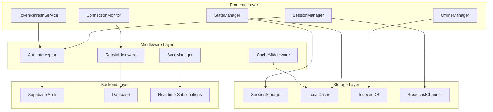

# Design Document

## Overview

This design document outlines the architecture and implementation approach for resolving the application-wide session persistence and connection management issues in Analy-Ticket. The solution focuses on robust session management, automatic token refresh, connection monitoring, and graceful error recovery to eliminate the need for page refreshes after periods of inactivity.

## Architecture

### High-Level Architecture



### Core Components

The session persistence system will be built around these key components:

1. **SessionManager**: Central orchestrator for session lifecycle management
2. **ConnectionMonitor**: Real-time connection status monitoring and recovery
3. **TokenRefreshService**: Automatic token refresh with cross-tab synchronization
4. **StateManager**: Application state persistence and recovery
5. **OfflineManager**: Offline capability and data synchronization

## Components and Interfaces

### Core Service Interfaces

```typescript
interface ISessionManager {
  // Session lifecycle
  initializeSession(): Promise<void>
  validateSession(): Promise<boolean>
  refreshSession(): Promise<boolean>
  terminateSession(): Promise<void>
  
  // Session monitoring
  startSessionMonitoring(): void
  stopSessionMonitoring(): void
  getSessionStatus(): SessionStatus
  
  // Event handling
  onSessionExpiring(callback: (timeLeft: number) => void): void
  onSessionExpired(callback: () => void): void
  onSessionRefreshed(callback: (session: Session) => void): void
}

interface IConnectionMonitor {
  // Connection monitoring
  startMonitoring(): void
  stopMonitoring(): void
  isOnline(): boolean
  getConnectionQuality(): ConnectionQuality
  
  // Event handling
  onConnectionChange(callback: (status: ConnectionStatus) => void): void
  onReconnected(callback: () => void): void
  onConnectionLost(callback: () => void): void
}

interface ITokenRefreshService {
  // Token management
  refreshTokens(): Promise<TokenPair>
  scheduleRefresh(expiresIn: number): void
  cancelScheduledRefresh(): void
  
  // Cross-tab synchronization
  syncTokensAcrossTabs(tokens: TokenPair): void
  onTokensUpdated(callback: (tokens: TokenPair) => void): void
}

interface IStateManager {
  // State persistence
  saveState(key: string, state: any): Promise<void>
  restoreState(key: string): Promise<any>
  clearState(key: string): Promise<void>
  
  // Form auto-save
  enableAutoSave(formId: string, interval?: number): void
  disableAutoSave(formId: string): void
  restoreFormData(formId: string): Promise<any>
}
```

### Data Models

```typescript
interface SessionStatus {
  isActive: boolean
  expiresAt: Date
  timeUntilExpiry: number
  lastActivity: Date
  refreshToken: string
  accessToken: string
}

interface ConnectionStatus {
  isOnline: boolean
  quality: 'excellent' | 'good' | 'poor' | 'offline'
  latency: number
  lastConnected: Date
  reconnectAttempts: number
}

interface TokenPair {
  accessToken: string
  refreshToken: string
  expiresIn: number
  tokenType: string
}

interface ApplicationState {
  currentRoute: string
  formData: Record<string, any>
  userPreferences: any
  cachedData: Record<string, any>
  pendingActions: QueuedAction[]
}

interface QueuedAction {
  id: string
  type: string
  payload: any
  timestamp: Date
  retryCount: number
  maxRetries: number
}
```

## Session Management Implementation

### SessionManager Service

```typescript
class SessionManager implements ISessionManager {
  private sessionCheckInterval: NodeJS.Timeout | null = null
  private warningShown = false
  private readonly WARNING_THRESHOLD = 5 * 60 * 1000 // 5 minutes
  private readonly CHECK_INTERVAL = 30 * 1000 // 30 seconds
  
  async initializeSession(): Promise<void> {
    const session = await supabase.auth.getSession()
    
    if (session.data.session) {
      this.startSessionMonitoring()
      this.scheduleTokenRefresh(session.data.session)
      this.syncSessionAcrossTabs(session.data.session)
    }
  }
  
  async validateSession(): Promise<boolean> {
    try {
      const { data: { session }, error } = await supabase.auth.getSession()
      
      if (error || !session) {
        return false
      }
      
      // Check if token is still valid
      const now = new Date().getTime()
      const expiresAt = new Date(session.expires_at! * 1000).getTime()
      
      if (now >= expiresAt) {
        return await this.refreshSession()
      }
      
      return true
    } catch (error) {
      console.error('Session validation failed:', error)
      return false
    }
  }
  
  async refreshSession(): Promise<boolean> {
    try {
      const { data, error } = await supabase.auth.refreshSession()
      
      if (error || !data.session) {
        this.handleSessionExpired()
        return false
      }
      
      this.scheduleTokenRefresh(data.session)
      this.syncSessionAcrossTabs(data.session)
      this.notifySessionRefreshed(data.session)
      
      return true
    } catch (error) {
      console.error('Session refresh failed:', error)
      return false
    }
  }
  
  private startSessionMonitoring(): void {
    this.sessionCheckInterval = setInterval(() => {
      this.checkSessionStatus()
    }, this.CHECK_INTERVAL)
  }
  
  private async checkSessionStatus(): Promise<void> {
    const session = await supabase.auth.getSession()
    
    if (!session.data.session) {
      this.handleSessionExpired()
      return
    }
    
    const now = new Date().getTime()
    const expiresAt = new Date(session.data.session.expires_at! * 1000).getTime()
    const timeUntilExpiry = expiresAt - now
    
    if (timeUntilExpiry <= 0) {
      await this.refreshSession()
    } else if (timeUntilExpiry <= this.WARNING_THRESHOLD && !this.warningShown) {
      this.showExpirationWarning(timeUntilExpiry)
      this.warningShown = true
    }
  }
}
```

### Connection Monitoring

```typescript
class ConnectionMonitor implements IConnectionMonitor {
  private isMonitoring = false
  private connectionStatus: ConnectionStatus
  private heartbeatInterval: NodeJS.Timeout | null = null
  private reconnectAttempts = 0
  private readonly MAX_RECONNECT_ATTEMPTS = 5
  
  startMonitoring(): void {
    if (this.isMonitoring) return
    
    this.isMonitoring = true
    this.setupEventListeners()
    this.startHeartbeat()
    this.checkInitialConnection()
  }
  
  private setupEventListeners(): void {
    window.addEventListener('online', this.handleOnline.bind(this))
    window.addEventListener('offline', this.handleOffline.bind(this))
    
    // Monitor Supabase connection
    supabase.auth.onAuthStateChange((event, session) => {
      if (event === 'TOKEN_REFRESHED') {
        this.handleConnectionRestored()
      }
    })
  }
  
  private startHeartbeat(): void {
    this.heartbeatInterval = setInterval(async () => {
      await this.performHealthCheck()
    }, 30000) // Check every 30 seconds
  }
  
  private async performHealthCheck(): Promise<void> {
    try {
      const startTime = Date.now()
      
      // Simple health check query
      const { error } = await supabase
        .from('users')
        .select('id')
        .limit(1)
        .single()
      
      const latency = Date.now() - startTime
      
      if (error && error.code !== 'PGRST116') { // PGRST116 is "no rows returned"
        throw error
      }
      
      this.updateConnectionStatus({
        isOnline: true,
        quality: this.getQualityFromLatency(latency),
        latency,
        lastConnected: new Date(),
        reconnectAttempts: 0
      })
      
      this.reconnectAttempts = 0
      
    } catch (error) {
      this.handleConnectionError(error)
    }
  }
  
  private handleConnectionError(error: any): void {
    console.warn('Connection health check failed:', error)
    
    this.updateConnectionStatus({
      isOnline: false,
      quality: 'offline',
      latency: -1,
      lastConnected: this.connectionStatus.lastConnected,
      reconnectAttempts: this.reconnectAttempts + 1
    })
    
    if (this.reconnectAttempts < this.MAX_RECONNECT_ATTEMPTS) {
      this.scheduleReconnect()
    }
  }
  
  private scheduleReconnect(): void {
    const delay = Math.min(1000 * Math.pow(2, this.reconnectAttempts), 30000)
    
    setTimeout(() => {
      this.performHealthCheck()
    }, delay)
  }
}
```

## Token Refresh Implementation

### Automatic Token Refresh

```typescript
class TokenRefreshService implements ITokenRefreshService {
  private refreshTimeout: NodeJS.Timeout | null = null
  private broadcastChannel: BroadcastChannel
  private isRefreshing = false
  
  constructor() {
    this.broadcastChannel = new BroadcastChannel('token-refresh')
    this.setupCrossTabSync()
  }
  
  async refreshTokens(): Promise<TokenPair> {
    if (this.isRefreshing) {
      // Wait for ongoing refresh to complete
      return this.waitForRefresh()
    }
    
    this.isRefreshing = true
    
    try {
      const { data, error } = await supabase.auth.refreshSession()
      
      if (error || !data.session) {
        throw new Error('Token refresh failed')
      }
      
      const tokenPair: TokenPair = {
        accessToken: data.session.access_token,
        refreshToken: data.session.refresh_token!,
        expiresIn: data.session.expires_in!,
        tokenType: data.session.token_type!
      }
      
      this.syncTokensAcrossTabs(tokenPair)
      this.scheduleRefresh(tokenPair.expiresIn)
      
      return tokenPair
      
    } finally {
      this.isRefreshing = false
    }
  }
  
  scheduleRefresh(expiresIn: number): void {
    this.cancelScheduledRefresh()
    
    // Refresh 5 minutes before expiry
    const refreshIn = (expiresIn - 300) * 1000
    
    if (refreshIn > 0) {
      this.refreshTimeout = setTimeout(() => {
        this.refreshTokens()
      }, refreshIn)
    }
  }
  
  syncTokensAcrossTabs(tokens: TokenPair): void {
    this.broadcastChannel.postMessage({
      type: 'TOKEN_UPDATED',
      tokens
    })
  }
  
  private setupCrossTabSync(): void {
    this.broadcastChannel.addEventListener('message', (event) => {
      if (event.data.type === 'TOKEN_UPDATED') {
        this.handleTokensUpdated(event.data.tokens)
      }
    })
  }
}
```

## State Persistence Implementation

### Application State Manager

```typescript
class StateManager implements IStateManager {
  private autoSaveIntervals: Map<string, NodeJS.Timeout> = new Map()
  private readonly STORAGE_PREFIX = 'analy-ticket-state'
  
  async saveState(key: string, state: any): Promise<void> {
    try {
      const serializedState = JSON.stringify({
        data: state,
        timestamp: Date.now(),
        version: '1.0'
      })
      
      localStorage.setItem(`${this.STORAGE_PREFIX}-${key}`, serializedState)
      
      // Also save to IndexedDB for larger data
      if (this.isLargeData(serializedState)) {
        await this.saveToIndexedDB(key, state)
      }
      
    } catch (error) {
      console.error('Failed to save state:', error)
    }
  }
  
  async restoreState(key: string): Promise<any> {
    try {
      const stored = localStorage.getItem(`${this.STORAGE_PREFIX}-${key}`)
      
      if (!stored) {
        return null
      }
      
      const parsed = JSON.parse(stored)
      
      // Check if data is too old (older than 24 hours)
      if (Date.now() - parsed.timestamp > 24 * 60 * 60 * 1000) {
        this.clearState(key)
        return null
      }
      
      return parsed.data
      
    } catch (error) {
      console.error('Failed to restore state:', error)
      return null
    }
  }
  
  enableAutoSave(formId: string, interval: number = 30000): void {
    this.disableAutoSave(formId) // Clear existing interval
    
    const saveInterval = setInterval(() => {
      this.autoSaveForm(formId)
    }, interval)
    
    this.autoSaveIntervals.set(formId, saveInterval)
  }
  
  private async autoSaveForm(formId: string): Promise<void> {
    const formElement = document.getElementById(formId) as HTMLFormElement
    
    if (!formElement) {
      this.disableAutoSave(formId)
      return
    }
    
    const formData = new FormData(formElement)
    const data = Object.fromEntries(formData.entries())
    
    await this.saveState(`form-${formId}`, data)
  }
}
```

## Error Recovery and Fallback

### Comprehensive Error Handling

```typescript
class ErrorRecoveryManager {
  private retryQueues: Map<string, QueuedAction[]> = new Map()
  private readonly MAX_RETRY_ATTEMPTS = 3
  
  async handleApiError(error: any, context: ErrorContext): Promise<any> {
    switch (error.code) {
      case 'NETWORK_ERROR':
        return this.handleNetworkError(error, context)
      case 'AUTH_ERROR':
        return this.handleAuthError(error, context)
      case 'TIMEOUT_ERROR':
        return this.handleTimeoutError(error, context)
      default:
        return this.handleGenericError(error, context)
    }
  }
  
  private async handleNetworkError(error: any, context: ErrorContext): Promise<any> {
    // Queue the action for retry when connection is restored
    this.queueAction(context.action)
    
    // Try to serve from cache if available
    const cachedData = await this.getCachedData(context.cacheKey)
    if (cachedData) {
      return cachedData
    }
    
    // Show user-friendly error message
    this.showNetworkErrorMessage()
    
    throw error
  }
  
  private async handleAuthError(error: any, context: ErrorContext): Promise<any> {
    // Attempt token refresh
    const refreshed = await sessionManager.refreshSession()
    
    if (refreshed) {
      // Retry the original request
      return this.retryAction(context.action)
    }
    
    // Redirect to login
    this.redirectToLogin()
    throw error
  }
  
  private queueAction(action: QueuedAction): void {
    const queue = this.retryQueues.get(action.type) || []
    queue.push({
      ...action,
      retryCount: 0,
      timestamp: new Date()
    })
    this.retryQueues.set(action.type, queue)
  }
  
  async processRetryQueue(): Promise<void> {
    for (const [type, queue] of this.retryQueues.entries()) {
      const actionsToRetry = queue.filter(action => 
        action.retryCount < this.MAX_RETRY_ATTEMPTS
      )
      
      for (const action of actionsToRetry) {
        try {
          await this.retryAction(action)
          this.removeFromQueue(type, action.id)
        } catch (error) {
          action.retryCount++
          if (action.retryCount >= this.MAX_RETRY_ATTEMPTS) {
            this.removeFromQueue(type, action.id)
            this.handleFailedAction(action, error)
          }
        }
      }
    }
  }
}
```

## UI Components for Connection Status

### Connection Status Indicator

```typescript
const ConnectionStatusIndicator: React.FC = () => {
  const { connectionStatus } = useConnectionMonitor()
  const [showDetails, setShowDetails] = useState(false)
  
  const getStatusColor = (status: ConnectionStatus) => {
    if (!status.isOnline) return 'bg-red-500'
    if (status.quality === 'excellent') return 'bg-green-500'
    if (status.quality === 'good') return 'bg-yellow-500'
    return 'bg-orange-500'
  }
  
  const getStatusText = (status: ConnectionStatus) => {
    if (!status.isOnline) return 'Offline'
    return `Online (${status.quality})`
  }
  
  return (
    <div className="fixed bottom-4 right-4 z-50">
      <div 
        className="flex items-center space-x-2 bg-white dark:bg-gray-800 rounded-lg shadow-lg p-2 cursor-pointer"
        onClick={() => setShowDetails(!showDetails)}
      >
        <div 
          className={`w-3 h-3 rounded-full ${getStatusColor(connectionStatus)} ${
            connectionStatus.isOnline ? 'animate-pulse' : ''
          }`}
        />
        <span className="text-sm font-medium">
          {getStatusText(connectionStatus)}
        </span>
      </div>
      
      {showDetails && (
        <div className="mt-2 bg-white dark:bg-gray-800 rounded-lg shadow-lg p-4 min-w-[200px]">
          <div className="space-y-2 text-sm">
            <div>Status: {connectionStatus.isOnline ? 'Connected' : 'Disconnected'}</div>
            <div>Quality: {connectionStatus.quality}</div>
            {connectionStatus.latency > 0 && (
              <div>Latency: {connectionStatus.latency}ms</div>
            )}
            <div>Last Connected: {connectionStatus.lastConnected.toLocaleTimeString()}</div>
            {connectionStatus.reconnectAttempts > 0 && (
              <div>Reconnect Attempts: {connectionStatus.reconnectAttempts}</div>
            )}
          </div>
        </div>
      )}
    </div>
  )
}
```

### Session Expiration Warning

```typescript
const SessionExpirationWarning: React.FC = () => {
  const { sessionStatus, extendSession } = useSessionManager()
  const [timeLeft, setTimeLeft] = useState<number>(0)
  const [showWarning, setShowWarning] = useState(false)
  
  useEffect(() => {
    if (sessionStatus.timeUntilExpiry <= 5 * 60 * 1000) { // 5 minutes
      setShowWarning(true)
      setTimeLeft(sessionStatus.timeUntilExpiry)
      
      const interval = setInterval(() => {
        setTimeLeft(prev => {
          const newTime = prev - 1000
          if (newTime <= 0) {
            clearInterval(interval)
            return 0
          }
          return newTime
        })
      }, 1000)
      
      return () => clearInterval(interval)
    }
  }, [sessionStatus.timeUntilExpiry])
  
  const formatTime = (ms: number) => {
    const minutes = Math.floor(ms / 60000)
    const seconds = Math.floor((ms % 60000) / 1000)
    return `${minutes}:${seconds.toString().padStart(2, '0')}`
  }
  
  if (!showWarning) return null
  
  return (
    <div className="fixed top-4 right-4 z-50 bg-yellow-50 border border-yellow-200 rounded-lg p-4 shadow-lg max-w-sm">
      <div className="flex items-start space-x-3">
        <AlertTriangle className="h-5 w-5 text-yellow-600 mt-0.5" />
        <div className="flex-1">
          <h3 className="text-sm font-medium text-yellow-800">
            Session Expiring Soon
          </h3>
          <p className="text-sm text-yellow-700 mt-1">
            Your session will expire in {formatTime(timeLeft)}
          </p>
          <div className="mt-3 flex space-x-2">
            <Button
              size="sm"
              onClick={() => {
                extendSession()
                setShowWarning(false)
              }}
            >
              Extend Session
            </Button>
            <Button
              variant="outline"
              size="sm"
              onClick={() => setShowWarning(false)}
            >
              Dismiss
            </Button>
          </div>
        </div>
      </div>
    </div>
  )
}
```

## Testing Strategy

### Unit Testing

1. **Session Management Tests**: Test session validation, refresh, and expiration handling
2. **Connection Monitoring Tests**: Test connection detection, reconnection logic, and health checks
3. **Token Refresh Tests**: Test automatic refresh, cross-tab sync, and error handling
4. **State Persistence Tests**: Test state saving, restoration, and auto-save functionality

### Integration Testing

1. **End-to-End Session Flow**: Test complete session lifecycle from login to expiration
2. **Connection Recovery**: Test application behavior during network interruptions
3. **Cross-Tab Synchronization**: Test session sync across multiple browser tabs
4. **Offline/Online Transitions**: Test data sync when going offline and coming back online

### Performance Testing

1. **Memory Usage**: Ensure no memory leaks from intervals and event listeners
2. **Storage Performance**: Test performance with large amounts of cached data
3. **Network Efficiency**: Minimize unnecessary API calls and optimize retry strategies

This design provides a comprehensive solution to eliminate the need for page refreshes after periods of inactivity, ensuring a smooth and reliable user experience across the entire Analy-Ticket application.