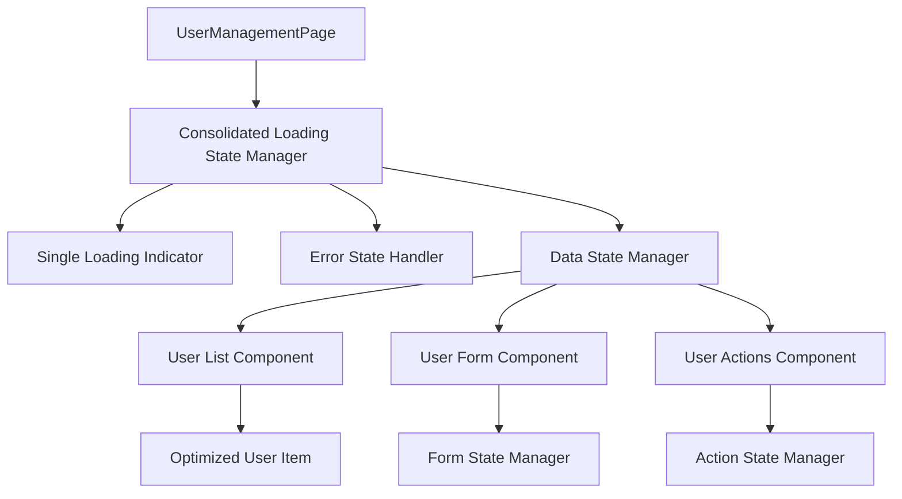

# Design Document

## Overview

The user management page flickering issue stems from multiple overlapping loading states, rapid state transitions, and inefficient re-rendering patterns. The current implementation uses multiple loading indicators that can conflict with each other, causing visual instability. This design addresses these issues through optimized state management, consolidated loading states, and improved component lifecycle management.

## Architecture

### Current Issues Identified

1. **Multiple Loading States**: The component has separate loading states for authentication (`authLoading`), data fetching (`loading`), and form submission (`isSubmitting`)
2. **Rapid State Transitions**: The `useRetryableQuery` hook can cause rapid loading state changes during retries
3. **Inefficient Re-renders**: Multiple `useEffect` hooks and state updates cause unnecessary component re-renders
4. **Overlapping Error States**: Error boundaries and retry mechanisms can conflict with each other

### Proposed Solution Architecture



## Components and Interfaces

### 1. Loading State Manager

A centralized state manager that consolidates all loading states into a single, predictable interface:

```typescript
interface LoadingStateManager {
  isLoading: boolean;
  loadingType: 'initial' | 'refresh' | 'action' | null;
  error: string | null;
  retryCount: number;
  canRetry: boolean;
}
```

### 2. Optimized UserManagement Component

The main component will be restructured to:
- Use a single loading state that prevents flickering
- Implement proper loading state transitions
- Minimize re-renders through React.memo and useMemo
- Separate concerns between data fetching and UI rendering

### 3. User List Virtualization

For better performance and stability:
- Implement virtual scrolling for large user lists
- Use React.memo for individual user items
- Optimize filtering and searching operations

### 4. Form State Isolation

Separate form operations from the main component state:
- Independent form state management
- Prevent form operations from triggering main component re-renders
- Optimistic updates with rollback capability

## Data Models

### Enhanced User Interface

```typescript
interface User {
  id: string;
  name: string;
  email: string;
  role: "user" | "agent" | "admin";
  avatar_url?: string | null;
  created_at: string;
  updated_at: string;
  full_name?: string;
  temporary_password?: string | null;
  temporary_password_expires_at?: string | null;
  must_change_password?: boolean;
  // Add loading state for individual users
  _isUpdating?: boolean;
  _hasError?: boolean;
}
```

### Loading State Model

```typescript
interface ComponentLoadingState {
  phase: 'initializing' | 'loading' | 'ready' | 'error';
  operation: string | null;
  progress?: number;
  message?: string;
}
```

## Error Handling

### Consolidated Error Management

1. **Single Error Boundary**: Wrap the entire component in one error boundary
2. **Graceful Degradation**: Show partial data when possible
3. **Clear Error Messages**: Provide actionable error information
4. **Retry Strategy**: Implement exponential backoff for retries

### Error State Hierarchy

```
1. Authentication Errors (highest priority)
2. Permission Errors
3. Network/API Errors
4. Validation Errors (lowest priority)
```

## Testing Strategy

### Unit Tests

1. **Loading State Transitions**: Test all loading state changes
2. **Error Handling**: Verify error states and recovery
3. **State Management**: Test state updates and side effects
4. **Component Rendering**: Verify stable rendering patterns

### Integration Tests

1. **User Flow Testing**: Complete user management workflows
2. **Error Recovery**: Test error scenarios and recovery
3. **Performance Testing**: Measure rendering performance
4. **Accessibility Testing**: Ensure stable focus management

### Visual Regression Tests

1. **Loading State Consistency**: Verify no flickering occurs
2. **Transition Smoothness**: Test state transition animations
3. **Error State Display**: Verify error state appearance
4. **Responsive Behavior**: Test across different screen sizes

## Performance Optimizations

### Rendering Optimizations

1. **React.memo**: Memoize user list items and form components
2. **useMemo**: Cache expensive computations (filtering, sorting)
3. **useCallback**: Stabilize event handlers to prevent re-renders
4. **Lazy Loading**: Load user details on demand

### State Management Optimizations

1. **Debounced Search**: Prevent excessive API calls during search
2. **Optimistic Updates**: Update UI immediately, rollback on error
3. **Batch Updates**: Group related state updates together
4. **Cleanup**: Proper cleanup of subscriptions and timers

### Network Optimizations

1. **Request Deduplication**: Prevent duplicate API calls
2. **Caching Strategy**: Cache user data with appropriate TTL
3. **Pagination**: Load users in chunks to improve initial load time
4. **Background Refresh**: Update data without blocking UI

## Implementation Phases

### Phase 1: State Consolidation
- Implement centralized loading state manager
- Replace multiple loading states with single state
- Add proper loading transitions

### Phase 2: Component Optimization
- Implement React.memo for user items
- Add useMemo for expensive operations
- Optimize event handlers with useCallback

### Phase 3: Error Handling Enhancement
- Implement consolidated error boundary
- Add graceful error recovery
- Improve error messaging

### Phase 4: Performance Tuning
- Add virtual scrolling if needed
- Implement request deduplication
- Add background data refresh

This design ensures a stable, performant user management interface that eliminates flickering and provides a smooth user experience.