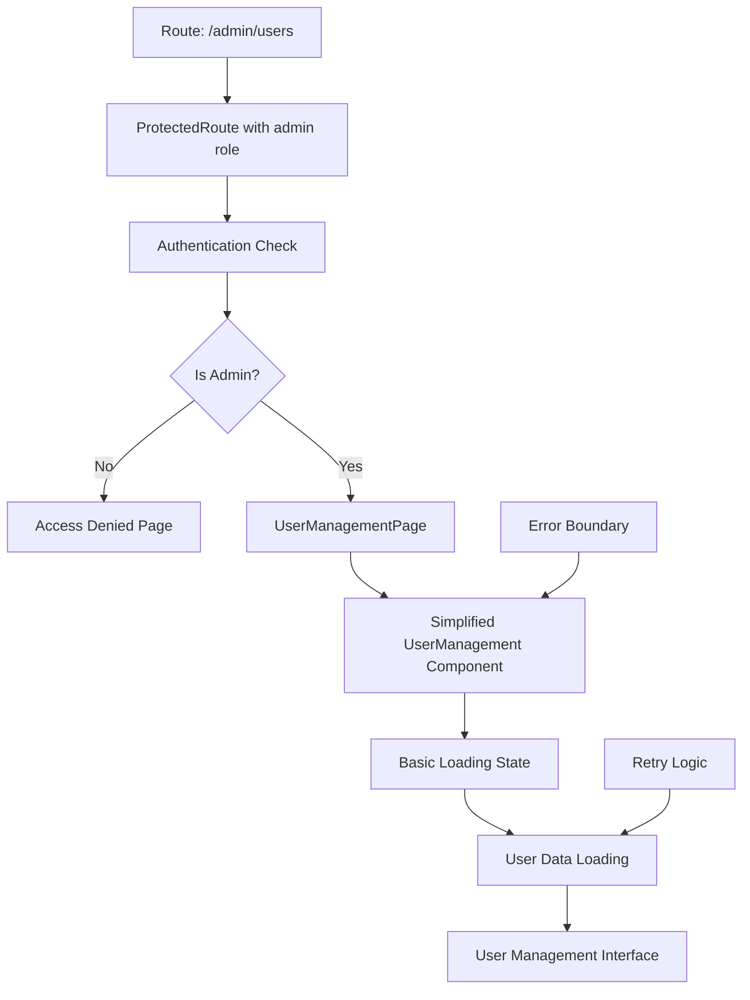

# Design Document

## Overview

The User Management page loading issue stems from several potential problems: missing admin role protection on the route, complex authentication state management, and potential conflicts between multiple loading states. The current implementation has sophisticated loading management but may be over-engineered, causing initialization problems.

The solution focuses on simplifying the authentication flow, ensuring proper route protection, and implementing a more straightforward loading state management approach that prioritizes reliability over complexity.

## Architecture

### Current Issues Identified

1. **Missing Route Protection**: The `/admin/users` route lacks `requiredRole="admin"` protection
2. **Complex Loading States**: Multiple overlapping loading managers may cause conflicts
3. **Authentication State Conflicts**: The `useOptimizedAuth` hook may be blocking data loading unnecessarily
4. **Component Initialization**: Heavy initialization logic may prevent the component from rendering

### Proposed Solution Architecture



## Components and Interfaces

### 1. Enhanced Route Protection

Update the route configuration to include proper admin role checking:

```typescript
<Route
  path="/admin/users"
  element={
    <ProtectedRoute requiredRole="admin">
      <AppLayout>
        <UserManagementPage />
      </AppLayout>
    </ProtectedRoute>
  }
/>
```

### 2. Simplified UserManagement Component

Create a streamlined version that focuses on core functionality:

```typescript
interface SimplifiedUserManagementProps {
  // Minimal props for basic functionality
}

interface UserManagementState {
  users: User[];
  loading: boolean;
  error: string | null;
  initialized: boolean;
}
```

### 3. Basic Loading State Manager

Replace complex loading management with a simple, reliable approach:

```typescript
interface BasicLoadingState {
  isLoading: boolean;
  error: string | null;
  canRetry: boolean;
  retryCount: number;
}
```

### 4. Fallback Component

Create a minimal fallback component for when the main component fails:

```typescript
interface UserManagementFallbackProps {
  error?: string;
  onRetry?: () => void;
}
```

## Data Models

### Simplified User Interface

```typescript
interface User {
  id: string;
  name: string;
  email: string;
  role: "user" | "agent" | "admin";
  created_at: string;
  updated_at: string;
}
```

### Loading State Model

```typescript
interface LoadingState {
  phase: 'initializing' | 'loading' | 'ready' | 'error';
  message?: string;
  canRetry: boolean;
}
```

## Error Handling

### Simplified Error Management

1. **Single Error Boundary**: One error boundary for the entire component
2. **Basic Retry Logic**: Simple retry with exponential backoff
3. **Clear Error Messages**: User-friendly error descriptions
4. **Fallback UI**: Minimal interface when main component fails

### Error Recovery Strategy

```
1. Component Initialization Error → Show fallback component
2. Authentication Error → Redirect to login
3. Authorization Error → Show access denied
4. Data Loading Error → Show retry interface
5. Network Error → Automatic retry with user feedback
```

## Testing Strategy

### Unit Tests

1. **Route Protection**: Test admin role requirement
2. **Authentication Flow**: Test login/logout scenarios
3. **Loading States**: Test loading state transitions
4. **Error Handling**: Test error scenarios and recovery

### Integration Tests

1. **Full Page Load**: Test complete page loading flow
2. **Authentication Integration**: Test with real auth states
3. **Error Recovery**: Test error scenarios and recovery
4. **Performance**: Test loading times and responsiveness

### Manual Testing Checklist

1. **Admin Access**: Verify admin users can access the page
2. **Non-Admin Block**: Verify non-admin users are blocked
3. **Loading Performance**: Verify page loads within 3 seconds
4. **Error Recovery**: Test network failures and recovery
5. **Browser Compatibility**: Test across different browsers

## Performance Optimizations

### Simplified Approach

1. **Remove Complex Hooks**: Replace `useOptimizedAuth`, `useConsolidatedLoading` with simpler alternatives
2. **Basic Memoization**: Use React.memo only where necessary
3. **Straightforward Data Fetching**: Use simple useEffect for data loading
4. **Minimal State Management**: Reduce state complexity

### Loading Optimizations

1. **Single Loading State**: One loading indicator for the entire component
2. **Progressive Loading**: Load critical data first, then additional features
3. **Error Boundaries**: Prevent component crashes from blocking the page
4. **Graceful Degradation**: Show partial functionality when possible

## Implementation Phases

### Phase 1: Route Protection Fix
- Add `requiredRole="admin"` to the route
- Test admin access control
- Verify non-admin users are blocked

### Phase 2: Component Simplification
- Create simplified UserManagement component
- Remove complex loading state management
- Implement basic data fetching

### Phase 3: Error Handling Enhancement
- Add error boundary around the component
- Implement basic retry logic
- Add fallback UI for failures

### Phase 4: Testing and Validation
- Test all authentication scenarios
- Verify loading performance
- Test error recovery flows

## Rollback Strategy

If the simplified approach doesn't work:

1. **Incremental Rollback**: Restore complex hooks one by one
2. **Component Isolation**: Test components in isolation
3. **Debug Mode**: Add extensive logging to identify issues
4. **Alternative Approaches**: Consider different authentication patterns

This design prioritizes reliability and simplicity over advanced features to ensure the User Management page loads consistently for administrators.