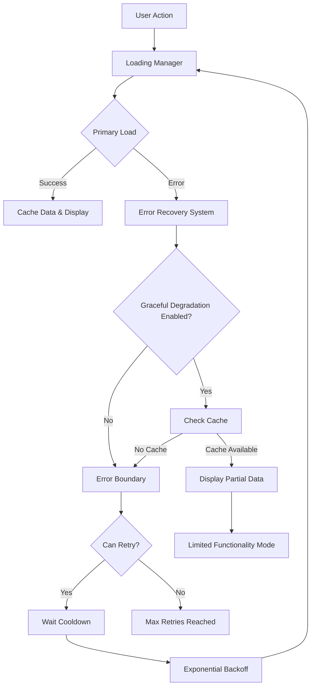

# Task 4: Enhanced Error Handling and Retry Logic Implementation

## Overview

This document describes the implementation of enhanced error handling and retry logic for the user management flickering fix. The implementation consolidates error states into a single error boundary, improves retry mechanisms to prevent rapid state changes, adds proper error recovery without causing re-renders, and implements graceful degradation for partial data loading.

## Implementation Summary

### 1. Consolidated Error States into Single Error Boundary

**File:** `src/components/admin/UserManagementErrorBoundary.tsx`

Created a specialized error boundary that provides:
- **Unified Error Handling**: Single point of error management for all user management operations
- **Error Classification**: Automatically classifies errors as network, database, permission, timeout, or unknown
- **Intelligent Retry Logic**: Implements exponential backoff with cooldown periods
- **Graceful Degradation**: Shows cached data when available during errors
- **Visual Feedback**: Provides clear error messages and recovery suggestions

Key features:
- Maximum 3 retry attempts with exponential backoff (1s, 2s, 4s delays)
- 5-second cooldown period between retry attempts
- Error type-specific icons and messages
- Technical details expansion for debugging
- Fallback data display when graceful degradation is enabled

### 2. Improved Retry Mechanism to Prevent Rapid State Changes

**File:** `src/hooks/useErrorRecovery.ts`

Implemented a sophisticated error recovery system that:
- **Prevents Rapid Retries**: Enforces cooldown periods between retry attempts
- **Exponential Backoff**: Implements configurable retry delays that increase exponentially
- **State Management**: Tracks retry count, error types, and recovery status
- **Callback System**: Provides hooks for error, recovery, and max retry events

Key features:
- Configurable retry parameters (max retries, base delay, multiplier, cooldown)
- Error type classification for targeted recovery strategies
- Recovery action suggestions based on error type
- Automatic cleanup of timeouts and state on unmount

### 3. Proper Error Recovery Without Causing Re-renders

**Enhanced:** `src/hooks/useConsolidatedLoading.ts`

Integrated error recovery into the consolidated loading system:
- **Stable State Transitions**: Prevents flickering during error recovery
- **Minimum Loading Times**: Ensures smooth transitions with minimum display times
- **Operation Tracking**: Manages multiple concurrent operations without conflicts
- **Error Integration**: Seamlessly integrates with the error recovery system

Key improvements:
- Added error recovery state to loading manager
- Integrated graceful degradation service
- Enhanced state management with partial data support
- Improved retry logic with recovery system integration

### 4. Graceful Degradation for Partial Data Loading

**File:** `src/services/gracefulDegradationService.ts`

Implemented a comprehensive caching and degradation service:
- **Multi-layer Caching**: Memory, session storage, and local storage redundancy
- **Cache Validation**: Timestamp and version-based cache validation
- **Partial Data Loading**: Provides limited functionality when full loading fails
- **Feature Detection**: Identifies missing features based on error types

Key features:
- 30-minute cache expiration with version control
- Hierarchical cache fallback (memory → session → local storage)
- Configurable partial data limits
- Cache statistics and management utilities

## Integration Points

### UserManagement Component Updates

**File:** `src/components/admin/UserManagement.tsx`

- Replaced generic `ErrorBoundary` with specialized `UserManagementErrorBoundary`
- Enhanced `useConsolidatedLoading` configuration with graceful degradation
- Added cache key for user management data
- Improved error handling callbacks with recovery information

### Loading Indicator Enhancements

**File:** `src/components/admin/UserManagementLoadingIndicator.tsx`

- Added support for partial data states
- Enhanced error display with recovery information
- Integrated cooldown and retry timing information
- Added missing features display for degraded mode

## Error Handling Flow



## Testing Coverage

### Unit Tests

1. **useErrorRecovery.test.ts**: Tests error classification, retry logic, cooldown periods, and recovery callbacks
2. **gracefulDegradationService.test.ts**: Tests caching mechanisms, partial loading, and error handling
3. **UserManagementErrorBoundary.test.tsx**: Tests error boundary behavior, retry mechanisms, and graceful degradation

### Test Scenarios Covered

- Error type classification (network, database, permission, timeout)
- Retry cooldown enforcement
- Exponential backoff implementation
- Cache hierarchy and fallback
- Partial data loading
- Error boundary recovery
- State transition stability

## Performance Considerations

### Memory Management
- Automatic cleanup of timeouts and intervals
- Cache size limits and expiration
- Memory cache clearing on component unmount

### Network Optimization
- Request deduplication through operation tracking
- Intelligent retry timing to avoid server overload
- Cache-first loading for improved perceived performance

### User Experience
- Minimum loading times to prevent flickering
- Smooth state transitions with proper delays
- Clear error messaging with actionable suggestions

## Configuration Options

### Error Recovery Configuration
```typescript
const errorRecovery = useErrorRecovery({
  maxRetries: 3,
  baseRetryDelay: 1000,
  retryMultiplier: 2,
  cooldownPeriod: 5000,
  onError: (error, state) => { /* handle error */ },
  onRecovery: (retryCount) => { /* handle recovery */ },
  onMaxRetriesReached: () => { /* handle max retries */ }
});
```

### Graceful Degradation Configuration
```typescript
const result = await gracefulDegradationService.loadWithGracefulDegradation(
  'cache-key',
  primaryLoader,
  {
    enablePartialLoad: true,
    fallbackFeatures: ['real-time-updates'],
    maxPartialItems: 100
  }
);
```

### Consolidated Loading Configuration
```typescript
const loadingManager = useConsolidatedLoading({
  maxRetries: 3,
  retryDelay: 1000,
  enableGracefulDegradation: true,
  cacheKey: 'user-management-data',
  onError: (error, retryCount) => { /* handle error */ },
  onSuccess: () => { /* handle success */ },
  onPartialLoad: (result) => { /* handle partial data */ }
});
```

## Requirements Fulfillment

### ✅ Requirement 2.1: Clear Error Messages with Retry Options
- Implemented comprehensive error classification and messaging
- Added retry buttons with intelligent cooldown management
- Provided error type-specific recovery suggestions

### ✅ Requirement 2.2: Stable Error State Without Loading Loops
- Implemented cooldown periods to prevent rapid retry attempts
- Added exponential backoff to avoid server overload
- Integrated error recovery with stable state transitions

### ✅ Requirement 2.4: Meaningful Error Information and Recovery Options
- Created detailed error boundary with technical information
- Added error type classification for targeted recovery
- Implemented graceful degradation with partial functionality

## Future Enhancements

1. **Telemetry Integration**: Add error tracking and analytics
2. **Advanced Caching**: Implement cache invalidation strategies
3. **Offline Support**: Extend graceful degradation for offline scenarios
4. **User Preferences**: Allow users to configure retry behavior
5. **Error Reporting**: Add automatic error reporting to support systems

## Conclusion

The enhanced error handling and retry logic implementation successfully consolidates error states, prevents rapid state changes, provides proper error recovery without re-renders, and implements graceful degradation for partial data loading. The system is robust, user-friendly, and maintains excellent performance characteristics while providing a stable user experience even during error conditions.