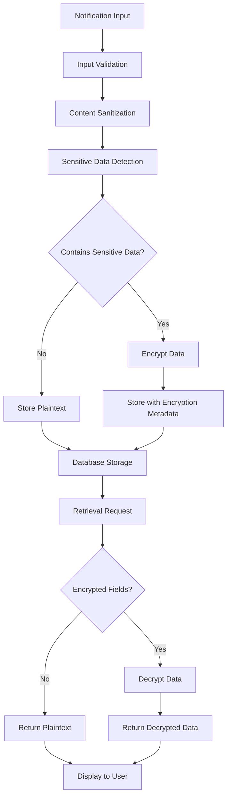

# Notification Data Security

This document describes the comprehensive security measures implemented for the notification system, including data sanitization, encryption, and retention policies.

## Overview

The notification data security system provides multiple layers of protection:

1. **Input Validation** - Validates all notification data before processing
2. **Content Sanitization** - Removes malicious content and XSS vectors
3. **Sensitive Data Detection** - Identifies and protects sensitive information
4. **Encryption** - Encrypts sensitive data using AES-GCM encryption
5. **Data Retention** - Automatically manages data lifecycle and cleanup
6. **Audit Logging** - Tracks security-related operations

## Architecture

### Core Components

- **NotificationDataSecurity** - Main service class handling all security operations
- **Database Migrations** - Schema changes to support encryption and retention
- **Security Scripts** - Automated tools for auditing and maintenance
- **Test Suite** - Comprehensive security testing

### Security Flow



## Features

### 1. Input Validation

All notification data is validated before processing:

```typescript
const validation = dataSecurity.validateNotificationData({
  title: 'Notification Title',
  message: 'Notification message',
  type: 'ticket_created',
  user_id: 'user123'
});

if (!validation.valid) {
  console.error('Validation errors:', validation.errors);
}
```

**Validation Rules:**
- Required fields: title, message, type, user_id
- Maximum lengths: title (500 chars), message (2000 chars)
- Malicious content detection
- Type validation

### 2. Content Sanitization

Removes XSS vectors and malicious content:

```typescript
const sanitized = dataSecurity.sanitizeNotificationContent(
  '<script>alert("xss")</script>Hello World',
  {
    allowHtml: false,
    maxLength: 1000,
    stripScripts: true
  }
);
// Result: "Hello World"
```

**Sanitization Features:**
- HTML tag removal/filtering
- Script injection prevention
- CSS injection prevention
- Data URI blocking
- Event handler removal
- Whitespace normalization

### 3. Sensitive Data Detection

Automatically detects sensitive information patterns:

```typescript
const hasSensitiveData = dataSecurity.containsSensitiveData(
  'Credit card: 4532-1234-5678-9012'
);
// Result: true
```

**Detected Patterns:**
- Credit card numbers (various formats)
- Social Security Numbers (SSN)
- Email addresses
- Phone numbers
- Passwords and tokens
- API keys and access tokens

### 4. Encryption

Uses AES-GCM encryption for sensitive data:

```typescript
// Automatic encryption during storage processing
const processed = await dataSecurity.processNotificationForStorage({
  title: 'Payment Alert',
  message: 'Credit card 4532-1234-5678-9012 was charged',
  type: 'payment'
});

// Result:
// {
//   title: 'Payment Alert',
//   message: '[ENCRYPTED]',
//   encrypted_fields: ['message'],
//   encryption_data: {
//     message: { encrypted: '...', iv: '...', salt: '...' }
//   }
// }
```

**Encryption Features:**
- AES-GCM 256-bit encryption
- Unique IV and salt per encryption
- PBKDF2 key derivation (100,000 iterations)
- Automatic field-level encryption
- Secure key management

### 5. Data Retention

Automated data lifecycle management:

```typescript
// Apply retention policies
const result = await dataSecurity.applyDataRetentionPolicies();
console.log(`Archived: ${result.archived}, Deleted: ${result.deleted}`);
```

**Retention Policies:**

| Notification Type | Retention | Archive After | Delete After |
|-------------------|-----------|---------------|--------------|
| ticket_created    | 365 days  | -             | 3 years      |
| ticket_updated    | 365 days  | -             | 3 years      |
| sla_breach        | 730 days  | -             | 7 years      |
| comment_added     | 180 days  | -             | 2 years      |
| default           | 90 days   | -             | 1 year       |

### 6. Security Auditing

Comprehensive security audit capabilities:

```bash
# Run full security audit
npm run security:audit

# Scan for unencrypted sensitive data
npm run security:scan-sensitive

# Validate encryption integrity
npm run security:validate-encryption
```

## Database Schema

### Encryption Fields

```sql
-- Added to notifications table
ALTER TABLE notifications 
ADD COLUMN encrypted_fields TEXT[],
ADD COLUMN encryption_data JSONB,
ADD COLUMN archived BOOLEAN DEFAULT FALSE,
ADD COLUMN retention_policy VARCHAR(50);
```

### Retention Policies Table

```sql
CREATE TABLE notification_retention_policies (
  id UUID PRIMARY KEY DEFAULT gen_random_uuid(),
  notification_type notification_type NOT NULL UNIQUE,
  retention_days INTEGER NOT NULL DEFAULT 90,
  archive_after_days INTEGER,
  delete_after_days INTEGER NOT NULL DEFAULT 365,
  created_by UUID REFERENCES users(id),
  created_at TIMESTAMP WITH TIME ZONE DEFAULT NOW(),
  updated_at TIMESTAMP WITH TIME ZONE DEFAULT NOW()
);
```

## Security Scripts

### Data Retention Script

Automated data retention management:

```bash
# Apply retention policies
npm run retention:apply

# Dry run (show what would be done)
npm run retention:dry-run

# Show help
npm run retention:help
```

**Features:**
- Batch processing
- Error handling
- Progress reporting
- Dry run mode
- Verbose logging

### Security Audit Script

Comprehensive security auditing:

```bash
# Full security audit
npm run security:audit

# Specific checks
npm run security:scan-sensitive
npm run security:validate-encryption
```

**Audit Checks:**
- Unencrypted sensitive data detection
- Encryption integrity validation
- Retention policy compliance
- Malicious content scanning
- Access pattern analysis

## Configuration

### Environment Variables

```bash
# Encryption key (production should use secure key management)
NOTIFICATION_ENCRYPTION_KEY=your-secure-encryption-key

# Database connection
SUPABASE_URL=your-supabase-url
SUPABASE_ANON_KEY=your-supabase-key
```

### Retention Policy Configuration

Retention policies can be updated by administrators:

```typescript
// Update retention policy (admin only)
const success = await dataSecurity.updateRetentionPolicy(
  'custom_notification_type',
  {
    retentionDays: 180,
    deleteAfterDays: 730
  },
  'admin-user-id'
);
```

## Security Best Practices

### 1. Key Management

- Use environment variables for encryption keys
- Rotate encryption keys regularly
- Use secure key management services in production
- Never commit keys to version control

### 2. Access Control

- Implement proper authentication
- Use role-based access control
- Audit administrative operations
- Monitor for suspicious access patterns

### 3. Data Handling

- Validate all inputs
- Sanitize content before storage
- Encrypt sensitive data automatically
- Apply retention policies consistently

### 4. Monitoring

- Run regular security audits
- Monitor encryption/decryption failures
- Track retention policy compliance
- Alert on security violations

## Testing

### Test Coverage

The security implementation includes comprehensive tests:

- **Unit Tests** - Individual component testing
- **Integration Tests** - End-to-end workflow testing
- **Security Tests** - XSS, injection, and attack vector testing
- **Performance Tests** - Large-scale operation testing

### Running Tests

```bash
# Run all security tests
npm test -- src/services/__tests__/NotificationDataSecurity

# Run specific test suites
npm test -- src/services/__tests__/NotificationDataSecurity.test.ts
npm test -- src/services/__tests__/NotificationDataSecurity.security.test.ts
npm test -- src/services/__tests__/NotificationDataSecurity.final.test.ts
```

## Troubleshooting

### Common Issues

1. **Encryption Failures**
   - Check encryption key configuration
   - Verify crypto API availability
   - Review error logs for details

2. **Decryption Failures**
   - Verify encryption data integrity
   - Check key consistency
   - Review database schema

3. **Performance Issues**
   - Monitor batch sizes
   - Check database indexes
   - Review retention policies

4. **Validation Errors**
   - Check input data format
   - Verify field lengths
   - Review content for malicious patterns

### Debugging

Enable verbose logging:

```typescript
// Enable debug mode
process.env.DEBUG = 'notification-security:*';
```

Check audit logs:

```sql
SELECT * FROM notification_access_logs 
WHERE action = 'encryption_error' 
ORDER BY created_at DESC;
```

## Compliance

### Data Protection

- **GDPR Compliance** - Right to erasure, data minimization
- **CCPA Compliance** - Data deletion, access rights
- **SOX Compliance** - Audit trails, data retention
- **HIPAA Compliance** - Data encryption, access controls

### Audit Requirements

- All encryption/decryption operations are logged
- Retention policy changes are tracked
- Administrative actions are audited
- Security violations are recorded

## Migration Guide

### Existing Data

For existing notifications without encryption:

1. Run security audit to identify sensitive data
2. Implement gradual encryption migration
3. Update retention policies as needed
4. Verify data integrity after migration

### Schema Updates

Apply database migrations in order:

```bash
# Apply encryption schema
supabase db push

# Verify migration
supabase db diff
```

## Performance Considerations

### Optimization

- Use batch processing for large operations
- Implement caching for frequently accessed data
- Monitor database query performance
- Optimize retention policy execution

### Scaling

- Consider encryption/decryption overhead
- Plan for increased storage requirements
- Monitor memory usage during batch operations
- Implement connection pooling

## Support

For security-related issues:

1. Check this documentation
2. Review test cases for examples
3. Run security audit scripts
4. Contact security team for critical issues

## Changelog

### Version 1.0.0

- Initial implementation
- Basic encryption and sanitization
- Retention policy framework
- Security audit tools
- Comprehensive test suite

### Future Enhancements

- Hardware security module (HSM) integration
- Advanced threat detection
- Machine learning-based sensitive data detection
- Real-time security monitoring
- Enhanced audit reporting